This file is a merged representation of a subset of the codebase, containing files not matching ignore patterns, combined into a single document by Repomix.

<file_summary>
This section contains a summary of this file.

<purpose>
This file contains a packed representation of a subset of the repository's contents that is considered the most important context.
It is designed to be easily consumable by AI systems for analysis, code review,
or other automated processes.
</purpose>

<file_format>
The content is organized as follows:
1. This summary section
2. Repository information
3. Directory structure
4. Repository files (if enabled)
5. Multiple file entries, each consisting of:
  - File path as an attribute
  - Full contents of the file
</file_format>

<usage_guidelines>
- This file should be treated as read-only. Any changes should be made to the
  original repository files, not this packed version.
- When processing this file, use the file path to distinguish
  between different files in the repository.
- Be aware that this file may contain sensitive information. Handle it with
  the same level of security as you would the original repository.
</usage_guidelines>

<notes>
- Some files may have been excluded based on .gitignore rules and Repomix's configuration
- Binary files are not included in this packed representation. Please refer to the Repository Structure section for a complete list of file paths, including binary files
- Files matching these patterns are excluded: node_modules, .git, .env, .env.*
- Files matching patterns in .gitignore are excluded
- Files matching default ignore patterns are excluded
- Files are sorted by Git change count (files with more changes are at the bottom)
</notes>

</file_summary>

<directory_structure>
assets/
  css/
    carrinho.css
    home.css
    login.css
    produtos.css
    sobre.css
  img/
    Alexa.jpg
    anime.jpg
    BancoImobiliário.jpg
    BonecoPain.jpg
    BonecoRoronoa.jpg
    BonecosTheBigBangTheory.jpg
    CamisaFeminina.jpg
    CamisetaLuffy.jpg
    CanecaGameOfThrones.jpg
    ChaveiroEsfera.jpg
    ConsoleX9.jpg
    DvdsChaves.jpg
    headset.jpg
    JogoLegoBatman.jpg
    JogoXadrez.jpg
    MiniaturaNaveStarTrek.jpg
    Monitor.jpg
    QuebracabeçaBatman.jpg
    teclado.jpg
    tecladoGamer.jpg
    tecladoGamer2.jpg
  js/
    produtos.js
carrinho.html
index.html
login.html
produtos.html
README.md
sobre.html
</directory_structure>

<files>
This section contains the contents of the repository's files.

<file path="assets/css/carrinho.css">
/* Estilo geral da página */
body {
  margin: 0;
  background-color: #020617;
  color: white;
  font-family: Arial, sans-serif;
}

/* Cabeçalho com logo e menu */
.cabecalho {
  background-color: #030712;
  display: flex;
  justify-content: space-between;
  align-items: center;
  padding: 15px 100px;
  border-bottom: 1px solid #1e293b;
}

/* Logo ao lado do texto */
.logo {
  display: flex;
  align-items: center;
  gap: 10px;
}

.icone-logo {
  background: linear-gradient(135deg, #00d4ff, #9b5cff);
  padding: 10px;
  border-radius: 10px;
  font-weight: bold;
}

.logo h1 {
  font-size: 18px;
  margin: 0;
}

.logo p {
  font-size: 12px;
  margin: 0;
  color: #aaa;
}

/* Menu de navegação */
nav a {
  color: white;
  text-decoration: none;
  margin-left: 35px;
}

nav a:hover,
nav .ativo {
  color: #00d4ff;
}

/* Área central do carrinho vazio */
.carrinho-vazio {
  text-align: center;
  padding: 70px 20px 140px;
}

.icone-carrinho {
  font-size: 50px;
  margin-bottom: 20px;
}

.carrinho-vazio h2 {
  font-size: 30px;
  margin-bottom: 15px;
}

.carrinho-vazio p {
  color: #b6c2d9;
  margin-bottom: 30px;
}

/* Botão principal */
.botao-carrinho {
  display: inline-block;
  padding: 16px 32px;
  background: linear-gradient(90deg, #00d4ff, #9b2cff);
  color: white;
  text-decoration: none;
  border-radius: 8px;
  font-weight: bold;
}

.botao-carrinho:hover {
  opacity: 0.85;
}

/* Rodapé */
.rodape {
  background-color: #030712;
  border-top: 1px solid #1e293b;
  padding: 45px 100px 15px;
}

.conteudo-rodape {
  display: flex;
  justify-content: space-between;
  gap: 60px;
  border-bottom: 1px solid #31205c;
  padding-bottom: 35px;
}

.coluna-rodape {
  width: 30%;
}

.coluna-rodape p {
  color: #b6c2d9;
  line-height: 1.5;
}

.coluna-rodape h3 {
  margin-top: 0;
  margin-bottom: 20px;
}

.coluna-rodape a {
  display: block;
  color: #b6c2d9;
  text-decoration: none;
  margin-bottom: 14px;
}

.coluna-rodape a:hover {
  color: #00d4ff;
}

/* Ícones das redes sociais */
.redes-sociais {
  display: flex;
  gap: 14px;
  margin-top: 18px;
}

.redes-sociais a {
  width: 35px;
  height: 35px;
  background-color: #1e1238;
  border: 1px solid #6c2bd9;
  border-radius: 50%;
  display: flex;
  justify-content: center;
  align-items: center;
  color: #b6c2d9;
  margin: 0;
}

/* Texto final do rodapé */
.direitos {
  text-align: center;
  color: #b6c2d9;
  margin-top: 30px;
}

/* Contador do carrinho */
#contador-carrinho {
  background-color: #00d4ff;
  color: #020617;
  padding: 2px 6px;
  border-radius: 50%;
  font-size: 12px;
  font-weight: bold;
}
</file>

<file path="assets/css/home.css">
/* Estilo geral da página */
body {
  margin: 0;
  background-color: #020617;
  color: white;
  font-family: Arial, sans-serif;
}

/* Cabeçalho com logo e menu */
.cabecalho {
  background-color: #030712;
  display: flex;
  justify-content: space-around;
  align-items: center;
 padding: 15px 40px;
}

/* Logo ao lado do texto */
.logo {
  display: flex;
  align-items: center;
  gap: 10px;
}

.icone-logo {
  background: linear-gradient(135deg, #00d4ff, #9b5cff);
  padding: 10px;
  border-radius: 10px;
  font-weight: bold;
}

.logo h1 {
  font-size: 18px;
  margin: 0;
}

.logo p {
  font-size: 12px;
  margin: 0;
  color: #aaa;
}

/* Menu de navegação */
nav a {
  color: white;
  text-decoration: none;
  margin-left: 30px;
}

nav a:hover,
nav .ativo {
  color: #00d4ff;
}

/* Área principal de apresentação */
.hero {
  text-align: center;
  padding: 70px 20px;
  background: linear-gradient(135deg, #17112f, #111827);
}

.hero h2 {
  font-size: 60px;
  margin: 0;
}

.hero h2 span {
  color: #8b5cf6;
}

.hero p {
  max-width: 620px;
  margin: 20px auto;
  font-size: 18px;
}

/* Botões da área principal */
.botao {
  display: inline-block;
  padding: 14px 28px;
  border-radius: 8px;
  margin: 10px;
  text-decoration: none;
  color: white;
  font-weight: bold;
  margin-top: 20px;
}

.principal {
  background: linear-gradient(90deg, #00d4ff, #9b2cff);
}

.secundario {
  background-color: #1f1b2e;
  border: 1px solid #333;
}

/* Seção das categorias */
.categorias {
  text-align: center;
  padding: 60px 20px;
  background-color: #020617;
}

.categorias h3 {
  font-size: 32px;
  margin-bottom: 10px;
}

.categorias > p {
  color: #b6c2d9;
}

/* Cards lado a lado */
.cards {
  display: flex;
  justify-content: center;
  gap: 15px;
  margin-top: 40px;
  flex-wrap: wrap;
}

.card-home {
  background-color: #182233;
  width: 160px;
  padding: 30px;
  border-radius: 10px;
  border: 1px solid #2d3b55;
  text-align: center;
}

.card-home p {
  font-size: 40px;
  margin: 0;
}

.card-home h4 {
  font-size: 18px;
}

/* Efeito quando passa o mouse no card */
.card-home:hover {
  transform: translateY(-5px); /* sobe um pouquinho */
  border-color: #00d4ff;       /* muda a borda */
}

/* Animação suave nos cards */
.card-home {
  transition: 0.3s;
}

/* Efeito ao passar o mouse no botão principal */
.principal:hover {
  opacity: 0.85;
}

/* Efeito no botão secundário */
.secundario:hover {
  background-color: #2a2440;
}

/* Sombra simples nos cards */
.card-home {
  box-shadow: 0 0 15px rgba(0, 0, 0, 0.3);
}

/* Sombra no botão principal */
.principal {
  box-shadow: 0 0 15px rgba(0, 212, 255, 0.4);
}

/* Rodapé */
.rodape {
  text-align: center;
  padding: 20px;
  background-color: #030712;
  color: #aaa;
}
</file>

<file path="assets/css/login.css">
/* Estilo geral da página */
body {
  margin: 0;
  background-color: #020617;
  color: white;
  font-family: Arial, sans-serif;
}

/* Cabeçalho com logo e menu */
.cabecalho {
  background-color: #030712;
  display: flex;
  justify-content: space-between;
  align-items: center;
  padding: 15px 100px;
  border-bottom: 1px solid #1e293b;
}

/* Logo ao lado do texto */
.logo {
  display: flex;
  align-items: center;
  gap: 10px;
}

.icone-logo,
.icone-login {
  background: linear-gradient(135deg, #00d4ff, #9b5cff);
  padding: 10px;
  border-radius: 10px;
  font-weight: bold;
}

.logo h1 {
  font-size: 18px;
  margin: 0;
}

.logo p {
  font-size: 12px;
  margin: 0;
  color: #aaa;
}

/* Menu de navegação */
nav a {
  color: white;
  text-decoration: none;
  margin-left: 35px;
}

nav a:hover,
nav .ativo {
  color: #00d4ff;
}

/* Centraliza a área de login */
.conteudo-login {
  width: 420px;
  margin: 45px auto 0;
}

/* Parte de título acima do card */
.topo-login {
  text-align: center;
  margin-bottom: 30px;
}

.icone-login {
  display: inline-block;
  font-size: 22px;
}

.topo-login h2 {
  font-size: 28px;
  margin-bottom: 8px;
}

.topo-login p {
  color: #b6c2d9;
}

/* Card do formulário */
.card-login {
  background-color: #0f172a;
  border: 1px solid #31205c;
  border-radius: 12px;
  padding: 30px;
}

/* Organização do formulário */
form {
  display: flex;
  flex-direction: column;
}

label {
  font-weight: bold;
  margin-bottom: 8px;
}

input {
  padding: 15px;
  margin-bottom: 25px;
  background-color: #1e293b;
  border: 1px solid #31205c;
  border-radius: 8px;
  color: white;
  font-size: 15px;
}

/* Link de recuperar senha */
.esqueceu {
  color: #00d4ff;
  text-align: right;
  text-decoration: none;
  margin-bottom: 25px;
}

/* Botão principal */
button {
  padding: 15px;
  background: linear-gradient(90deg, #00d4ff, #9b2cff);
  color: white;
  border: none;
  border-radius: 8px;
  font-weight: bold;
  cursor: pointer;
}

button:hover {
  opacity: 0.85;
}

/* Texto de cadastro */
.cadastro {
  text-align: center;
  color: #b6c2d9;
}

.cadastro a {
  color: #00d4ff;
  text-decoration: none;
  font-weight: bold;
}

/* Linha com texto no meio */
.divisor {
  text-align: center;
  color: #b6c2d9;
  border-top: 1px solid #31205c;
  margin: 30px 0 20px;
}

.divisor span {
  background-color: #0f172a;
  padding: 0 10px;
  position: relative;
  top: -10px;
}

/* Botões de login social */
.login-social {
  display: flex;
  gap: 10px;
}

.login-social a {
  width: 50%;
  text-align: center;
  padding: 13px;
  color: white;
  text-decoration: none;
  background-color: #1f2937;
  border: 1px solid #374151;
  border-radius: 8px;
  font-weight: bold;
}

/* Rodapé */
.rodape {
  margin-top: 60px;
  padding: 25px;
  text-align: center;
  background-color: #030712;
  border-top: 1px solid #1e293b;
  color: #94a3b8;
}
</file>

<file path="assets/css/produtos.css">
/* Estilo geral da página */
body {
  margin: 0;
  background-color: #020617;
  color: white;
  font-family: Arial, sans-serif;
}

/* Cabeçalho com logo e menu */
.cabecalho {
  background-color: #030712;
  display: flex;
  justify-content: space-between;
  align-items: center;
  padding: 15px 100px;
  border-bottom: 1px solid #1e293b;
}

/* Logo ao lado do texto */
.logo {
  display: flex;
  align-items: center;
  gap: 10px;
}

.icone-logo {
  background: linear-gradient(135deg, #00d4ff, #9b5cff);
  padding: 10px;
  border-radius: 10px;
  font-weight: bold;
}

.logo h1 {
  font-size: 18px;
  margin: 0;
}

.logo p {
  font-size: 12px;
  margin: 0;
  color: #aaa;
}

/* Menu de navegação */
nav a {
  color: white;
  text-decoration: none;
  margin-left: 35px;
}

nav a:hover,
nav .ativo {
  color: #00d4ff;
}

/* Conteúdo central da página */
.conteudo {
  width: 87%;
  margin: 0 auto;
}

/* Título da página de produtos */
.titulo-pagina {
  margin: 35px 0;
}

.titulo-pagina h2 {
  font-size: 34px;
  margin-bottom: 10px;
}

.titulo-pagina p {
  color: #b6c2d9;
}

/* Área com filtros e produtos lado a lado */
.area-produtos {
  display: flex;
  gap: 30px;
}

/* Caixa de filtros */
.filtros {
  width: 220px;
  background-color: #0f172a;
  border: 1px solid #31205c;
  border-radius: 10px;
  padding: 22px;
}

.filtros h3 {
  margin-top: 0;
}

.filtros ul {
  list-style: none;
  padding: 0;
}

.filtros li {
  padding: 12px;
  color: #cbd5e1;
}

.filtros .selecionado {
  color: #00d4ff;
  border: 1px solid #00d4ff;
  border-radius: 8px;
  background-color: #24194a;
}

/* Área direita onde ficam busca e produtos */
.lista-produtos {
  flex: 1;
}

/* Campo de busca */
.lista-produtos input {
  width: 100%;
  padding: 15px;
  background-color: #080d19;
  border: 1px solid #31205c;
  border-radius: 8px;
  color: white;
  font-size: 15px;
}

.resultado {
  color: #b6c2d9;
  margin: 25px 0;
}

.resultado span {
  color: #00d4ff;
  font-weight: bold;
}

/* Produtos lado a lado */
.cards-produtos {
  display: flex;
  gap: 22px;
}

/* Card de produto */
.produto {
  background-color: #0f172a;
  border: 1px solid #31205c;
  border-radius: 10px;
  overflow: hidden;
  width: 30%;
}

/* Ajusta melhor as imagens */
.produto img {
  width: 100%;
  height: 230px;
  object-fit: contain;
  background-color: #ffffff;
  padding: 10px;
}

.info-produto {
  padding: 15px;
}

.info-produto h4 {
  font-size: 18px;
  margin: 5px 0 10px;
}

.info-produto p {
  color: #b6c2d9;
  font-size: 14px;
  line-height: 1.5;
}

/* Preço e botão do carrinho */
.preco-botao {
  display: flex;
  justify-content: space-between;
  align-items: center;
  margin-top: 20px;
}

.preco-botao strong {
  color: #00d4ff;
  font-size: 24px;
}

.preco-botao button {
  background: linear-gradient(135deg, #00d4ff, #9b5cff);
  color: white;
  border: none;
  padding: 12px;
  border-radius: 8px;
  cursor: pointer;
}

/* Permite quebrar os produtos para baixo */
.cards-produtos {
  display: flex;
  gap: 22px;
  flex-wrap: wrap;
}

/* Efeito ao passar o mouse no produto */
.produto:hover {
  transform: translateY(-5px);
  transition: 0.3s;
  border-color: #00d4ff;
}

/* Rodapé */
.rodape {
  text-align: center;
  padding: 20px;
  background-color: #030712;
  color: #aaa;
}
</file>

<file path="assets/css/sobre.css">
/* Estilo geral da página */
body {
  margin: 0;
  background-color: #020617;
  color: white;
  font-family: Arial, sans-serif;
}

/* Cabeçalho com logo e menu */
.cabecalho {
  background-color: #030712;
  display: flex;
  justify-content: space-between;
  align-items: center;
  padding: 15px 100px;
  border-bottom: 1px solid #1e293b;
}

/* Logo ao lado do texto */
.logo {
  display: flex;
  align-items: center;
  gap: 10px;
}

.icone-logo {
  background: linear-gradient(135deg, #00d4ff, #9b5cff);
  padding: 10px;
  border-radius: 10px;
  font-weight: bold;
}

.logo h1 {
  font-size: 18px;
  margin: 0;
}

.logo p {
  font-size: 12px;
  margin: 0;
  color: #aaa;
}

/* Menu de navegação */
nav a {
  color: white;
  text-decoration: none;
  margin-left: 35px;
}

nav a:hover,
nav .ativo {
  color: #00d4ff;
}

/* Conteúdo central */
.conteudo {
  width: 87%;
  margin: 0 auto;
}

/* Título da página sobre */
.topo-sobre {
  text-align: center;
  padding: 45px 20px 35px;
}

.topo-sobre h2 {
  font-size: 42px;
  margin-bottom: 15px;
}

.topo-sobre h2 span {
  color: #00d4ff;
}

.topo-sobre p {
  color: white;
  font-size: 17px;
}

/* Card da missão */
.missao {
  background-color: #182233;
  border: 1px solid #31205c;
  border-radius: 10px;
  padding: 45px;
  margin-top: 25px;
}

.missao h3 {
  font-size: 28px;
  margin-top: 0;
}

.missao p {
  font-size: 17px;
  line-height: 1.7;
}

/* Cards de valores */
.valores {
  display: flex;
  gap: 22px;
  margin-top: 45px;
}

.card-valor {
  background-color: #0f172a;
  border: 1px solid #31205c;
  border-radius: 10px;
  padding: 25px;
  width: 25%;
  text-align: center;
}

/* Ícones dos cards */
.icone-valor {
  width: 55px;
  height: 55px;
  margin: 0 auto 18px;
  border: 1px solid #00d4ff;
  border-radius: 50%;
  background-color: #16233a;
  color: #00d4ff;
  display: flex;
  align-items: center;
  justify-content: center;
  font-size: 26px;
}

.card-valor h4 {
  font-size: 18px;
  margin-bottom: 12px;
}

.card-valor p {
  color: #b6c2d9;
  line-height: 1.5;
}

/* Rodapé */
.rodape {
  text-align: center;
  padding: 20px;
  background-color: #030712;
  color: #aaa;
}
</file>

<file path="assets/js/produtos.js">
// Pega todos os produtos da página
const produtos = document.querySelectorAll(".produto");

// Pega todas as categorias do filtro
const categorias = document.querySelectorAll(".filtros li");

// Pega o campo de busca
const campoBusca = document.querySelector(".buscar-produto");

// Passa por cada categoria
categorias.forEach(function (categoria) {

  // Quando clicar em uma categoria
  categoria.addEventListener("click", function () {

    // Remove o selecionado de todas as categorias
    categorias.forEach(function (item) {
      item.classList.remove("selecionado");
    });

    // Marca a categoria clicada como selecionada
    categoria.classList.add("selecionado");

    // Pega o texto da categoria clicada
    const textoCategoria = categoria.textContent.toLowerCase();

    // Limpa o campo de busca quando trocar de categoria
    campoBusca.value = "";

    // Se clicar em todos, mostra todos os produtos
    if (textoCategoria.includes("todos")) {
      produtos.forEach(function (produto) {
        produto.style.display = "block";
      });
    }

    // Se clicar em filmes, mostra só filmes
    else if (textoCategoria.includes("filmes")) {
      filtrarProdutos("filmes");
    }

    // Se clicar em séries, mostra só séries
    else if (textoCategoria.includes("séries")) {
      filtrarProdutos("series");
    }

    // Se clicar em jogos, mostra só jogos
    else if (textoCategoria.includes("jogos")) {
      filtrarProdutos("jogos");
    }

    // Se clicar em animes, mostra só animes
    else if (textoCategoria.includes("animes")) {
      filtrarProdutos("animes");
    }

    // Se clicar em tecnologia, mostra só tecnologia
    else if (textoCategoria.includes("tecnologia")) {
      filtrarProdutos("tecnologia");
    }

  });
});

// Função para filtrar produtos
function filtrarProdutos(categoriaEscolhida) {

  // Passa por todos os produtos
  produtos.forEach(function (produto) {

    // Se o produto tiver a categoria escolhida, aparece
    if (produto.classList.contains(categoriaEscolhida)) {
      produto.style.display = "block";
    }

    // Se não tiver, fica escondido
    else {
      produto.style.display = "none";
    }

  });
}

// Quando digitar no campo de busca
campoBusca.addEventListener("input", function () {

  // Pega o texto digitado e deixa minúsculo
  const textoBusca = campoBusca.value.toLowerCase();

  // Passa por todos os produtos
  produtos.forEach(function (produto) {

    // Pega o título do produto
    const nomeProduto = produto.querySelector("h4").textContent.toLowerCase();

    // Se o nome incluir o texto digitado, aparece
    if (nomeProduto.includes(textoBusca)) {
      produto.style.display = "block";
    }

    // Se não incluir, esconde
    else {
      produto.style.display = "none";
    }

  });
});

// Pega todos os botões de carrinho dos produtos
const botoesCarrinho = document.querySelectorAll(".btn-carrinho");

// Pega o contador do carrinho
const contadorCarrinho = document.getElementById("contador-carrinho");

// Começa o carrinho com zero itens
let quantidadeCarrinho = 0;

// Passa por todos os botões
botoesCarrinho.forEach(function (botao) {

  // Quando clicar no botão
  botao.addEventListener("click", function () {

    // Aumenta a quantidade do carrinho
    quantidadeCarrinho++;

    // Atualiza o número que aparece no menu
    contadorCarrinho.textContent = quantidadeCarrinho;

    // Mostra uma mensagem simples
    alert("Produto adicionado ao carrinho!");
  });

});
</file>

<file path="carrinho.html">
<!DOCTYPE html>
<html lang="pt-BR">

<head>
  <meta charset="UTF-8">
  <meta name="viewport" content="width=device-width, initial-scale=1.0">
  <title>Carrinho - Geek Legends</title>

  <!-- CSS da página do carrinho -->
  <link rel="stylesheet" href="assets/css/carrinho.css">
</head>

<body>

  <!-- Cabeçalho com logo e menu -->
  <header class="cabecalho">
    

      
GL

      

        <h1>Geek Legends</h1>
        
Produtos Dignos de Lenda

      

    

    <nav>
      <a href="index.html">Início</a>
      <a href="produtos.html">Produtos</a>
      <a href="sobre.html">Sobre</a>
      <a href="login.html">Login</a>
      <a href="carrinho.html" class="link-carrinho"> 🛒 0 </a>
    </nav>
  </header>

  <main>

    <!-- Área do carrinho vazio -->
    <section class="carrinho-vazio">
      
🛒

      <h2>Seu carrinho está vazio</h2>

      
Adicione produtos ao carrinho para finalizar sua compra

      <a href="produtos.html" class="botao-carrinho">🛍️ Explorar Produtos</a>
    </section>

  </main>

  <!-- Rodapé -->
  <footer class="rodape">

    

      <!-- Informações da loja -->
      

        

          
GL

          

            <h1>Geek Legends</h1>
            
Produtos Dignos de Lenda

          

        

        

          Sua loja especializada em produtos geek, tecnologia e cultura nerd.
          Encontre os melhores itens para games, animes, filmes, séries e muito mais.
        

        

          <a href="#">f</a>
          <a href="#">◎</a>
          <a href="#">𝕏</a>
          <a href="#">⌘</a>
        

      

      <!-- Links rápidos -->
      

        <h3>Links Rápidos</h3>

        <a href="index.html">Início</a>
        <a href="produtos.html">Produtos</a>
       <a href="sobre.html">Sobre</a>
        <a href="carrinho.html">Carrinho</a>
      

      <!-- Informações extras -->
      

        <h3>Informações</h3>

        <a href="#">Política de Privacidade</a>
        <a href="#">Termos de Uso</a>
        <a href="#">Formas de Pagamento</a>
        <a href="#">Entrega & Frete</a>
      

    

    
© 2026 Geek Legends. Todos os direitos reservados.

  </footer>

</body>

</html>
</file>

<file path="index.html">
<!DOCTYPE html>
<html lang="pt-BR">

<head>
  <meta charset="UTF-8">
  <meta name="viewport" content="width=device-width, initial-scale=1.0">
  <title>Geek Legends</title>

  <!-- Arquivo CSS do projeto -->
  <link rel="stylesheet" href="assets/css/home.css">
</head>

<body>

  <!-- Cabeçalho com logo e menu -->
  <header class="cabecalho">
    

      
GL

      

        <h1>Geek Legends</h1>
        
Produtos Dignos de Lenda

      

    

    <nav>
      <a href="index.html" class="ativo">Início</a>
      <a href="produtos.html">Produtos</a>
      <a href="sobre.html">Sobre</a>
      <a href="login.html">Login</a>
      <a href="carrinho.html" class="link-carrinho"> 🛒 0 </a>
    </nav>
  </header>

  <main>

    <!-- Área principal de apresentação -->
    <section class="hero">
      <h2>Produtos Dignos de Lenda</h2>

      

        Descubra os melhores produtos geek, tecnologia de ponta e itens
        colecionáveis para verdadeiros fãs da cultura nerd e gamer.
      

      

        <a href="produtos.html" class="botao principal">Explorar Produtos →</a>
        <a href="#" class="botao secundario">Saiba Mais</a>
      

    </section>

    <!-- Cards das categorias -->
    <section class="categorias">
      <h3>Explore por Categoria</h3>
      
Encontre produtos das suas franquias e temas favoritos

      

        

          
🎬

          <h4>Filmes</h4>
        

        

          
📺

          <h4>Séries</h4>
        

        

          
🎮

          <h4>Jogos</h4>
        

        

          
⚡

          <h4>Animes</h4>
        

        

          
💻

          <h4>Tecnologia</h4>
        

      

    </section>

    <!-- Rodapé da página -->
<footer class="rodape">
  
© 2025 Geek Legends - Todos os direitos reservados.

</footer>

  </main>

</body>
</html>
</file>

<file path="login.html">
<!DOCTYPE html>
<html lang="pt-BR">

<head>
  <meta charset="UTF-8">
  <meta name="viewport" content="width=device-width, initial-scale=1.0">
  <title>Login - Geek Legends</title>

  <!-- CSS da página de login -->
  <link rel="stylesheet" href="assets/css/login.css">
</head>

<body>

  <!-- Cabeçalho com logo e menu -->
  <header class="cabecalho">
    

      
GL

      

        <h1>Geek Legends</h1>
        
Produtos Dignos de Lenda

      

    

    <nav>
      <a href="index.html">Início</a>
      <a href="produtos.html">Produtos</a>
      <a href="sobre.html">Sobre</a>
      <a href="login.html" class="ativo">Login</a>
      <a href="carrinho.html" class="link-carrinho"> 🛒 0 </a>
    </nav>
  </header>

  <main class="conteudo-login">

    <!-- Logo e título do login -->
    <section class="topo-login">
      
GL

      <h2>Bem-vindo de Volta!</h2>
      
Entre na sua conta para continuar

    </section>

    <!-- Card com formulário -->
    <section class="card-login">
      <form>
        <label for="email">Email</label>
        <input type="email" id="email" placeholder="✉️  seu@email.com">

        <label for="senha">Senha</label>
        <input type="password" id="senha" placeholder="🔒  ********">

        <a href="#" class="esqueceu">Esqueceu a senha?</a>

        <button type="submit">⚡ Entrar</button>
      </form>

      

        Não tem uma conta? <a href="#">Cadastre-se</a>
      

      

        ou continue com
      

      

        <a href="#">G Google</a>
        <a href="#">GitHub</a>
      

    </section>

    <!-- Rodapé -->
<footer class="rodape">
  
© 2025 Geek Legends - Todos os direitos reservados.

</footer>

  </main>

</body>

</html>
</file>

<file path="produtos.html">
<!DOCTYPE html>
<html lang="pt-BR">

<head>
  <meta charset="UTF-8">
  <meta name="viewport" content="width=device-width, initial-scale=1.0">
  <title>Produtos - Geek Legends</title>

  <!-- CSS da página de produtos -->
  <link rel="stylesheet" href="assets/css/produtos.css">
</head>

<body>

  <!-- Cabeçalho com logo e menu -->
  <header class="cabecalho">
    

      
GL

      

        <h1>Geek Legends</h1>
        
Produtos Dignos de Lenda

      

    

    <nav>
      <a href="index.html">Início</a>
      <a href="produtos.html" class="ativo">Produtos</a>
      <a href="sobre.html">Sobre</a>
      <a href="login.html">Login</a>
      <!-- Link do carrinho com contador -->
      <a href="carrinho.html" class="link-carrinho"> 🛒 0 </a>
    </nav>
  </header>

  <main class="conteudo">

    <!-- Título da página -->
    <section class="titulo-pagina">
      <h2>Nossos Produtos</h2>
      
Explore nossa coleção completa de produtos geek

    </section>

    <!-- Área principal com filtros e produtos -->
    <section class="area-produtos">

      <aside class="filtros">
        <h3>🔎 Filtros</h3>

        <h4>Categorias</h4>

        <ul>
          <li class="selecionado">Todos os Produtos</li>
          <li>🎬 Filmes</li>
          <li>📺 Séries</li>
          <li>🎮 Jogos</li>
          <li>⚡ Animes</li>
          <li>💻 Tecnologia</li>
        </ul>
      </aside>

      

        <!-- Campo de busca dos produtos -->
      <input type="text" class="buscar-produto" placeholder="🔍  Buscar produtos...">

        
Encontrados 18 produtos

        

          <!-- Tecnologia -->
          

            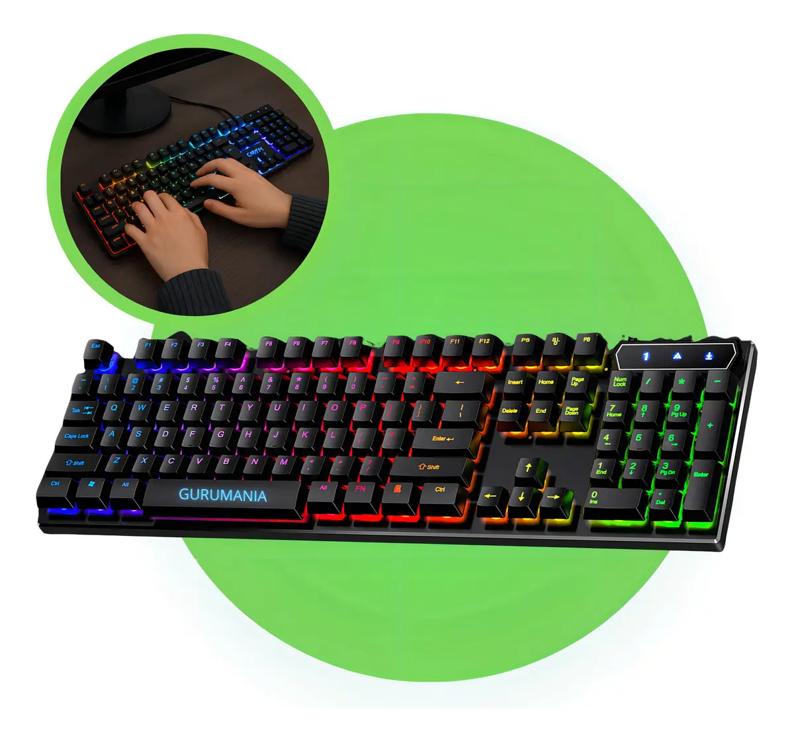

            

              <h4>Teclado Gamer Gurumania Semi Mecânico RGB</h4>
              
Teclado gamer semi mecânico com iluminação RGB e tecnologia Anti-Ghosting, ideal para jogos no PC, Xbox, PS4 e PS5.

              

                <strong>R$ 65,99</strong>
                 <!-- Botão para adicionar produto ao carrinho -->
                <button class="btn-carrinho">🛒</button>
              

            

          

          

            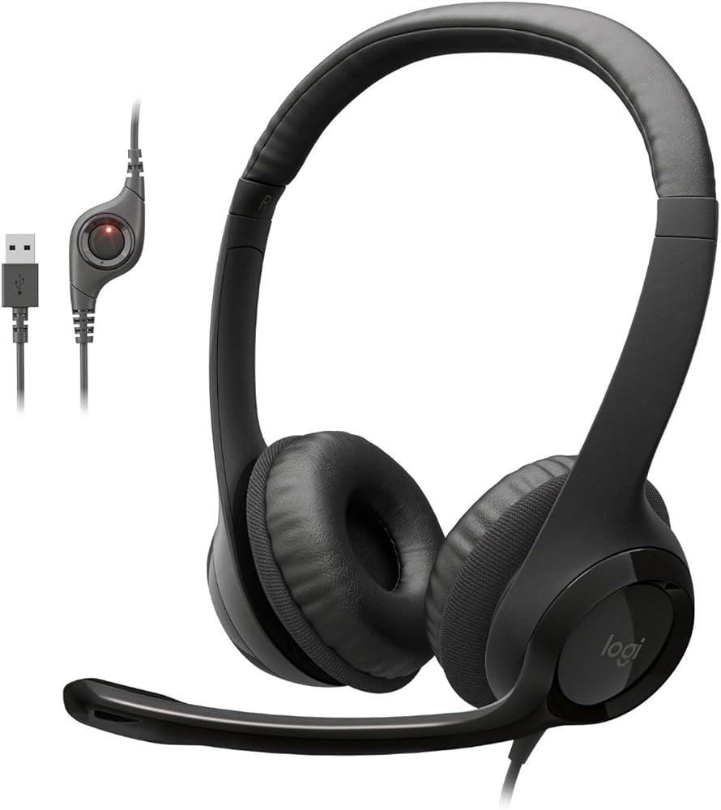

            

              <h4>Headset Cyberpunk Neon</h4>
              
Headset gamer com som surround, microfone integrado e cancelamento de ruído para partidas mais imersivas.

              

                <strong>R$ 389,90</strong>
                 <!-- Botão para adicionar produto ao carrinho -->
                <button class="btn-carrinho">🛒</button>
              

            

          

          <!-- Animes -->
          

            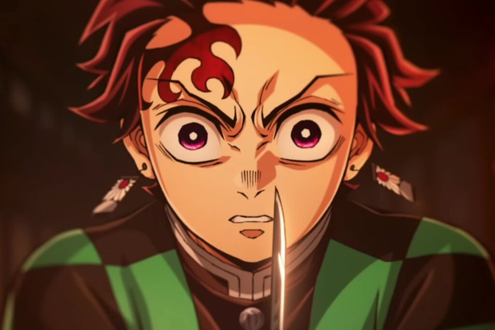

            

              <h4>Action Figure Anime Edition</h4>
              
Figure de coleção premium com visual inspirado em anime, acabamento detalhado e ótimo destaque para decoração.

              

                <strong>R$ 279,90</strong>
               <!-- Botão para adicionar produto ao carrinho -->
              <button class="btn-carrinho">🛒</button>
              

            

          

          <!-- Tecnologia -->
          

            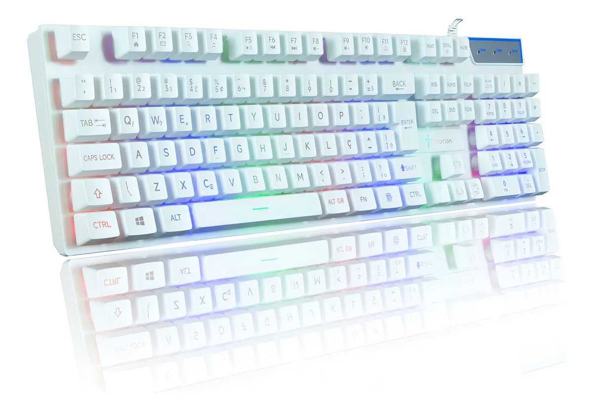

            

              <h4>Teclado Gamer Titorion Branco RGB</h4>
              
Teclado branco semi mecânico com LED Rainbow, resposta rápida e visual moderno para deixar o setup mais bonito.

              

                <strong>R$ 120,00</strong>
                 <!-- Botão para adicionar produto ao carrinho -->
                <button class="btn-carrinho">🛒</button>
              

            

          

          

            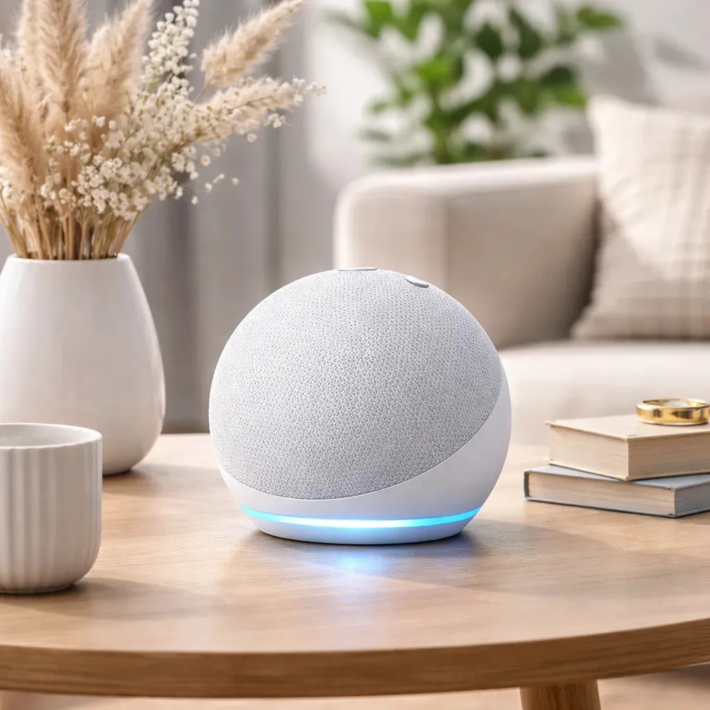

            

              <h4>Echo Dot 5ª Geração Amazon</h4>
              
Alto-falante inteligente com Alexa, som potente e controle por voz para músicas, podcasts e dispositivos da casa.

              

                <strong>R$ 430,00</strong>
                 <!-- Botão para adicionar produto ao carrinho -->
                <button class="btn-carrinho">🛒</button>
              

            

          

          

            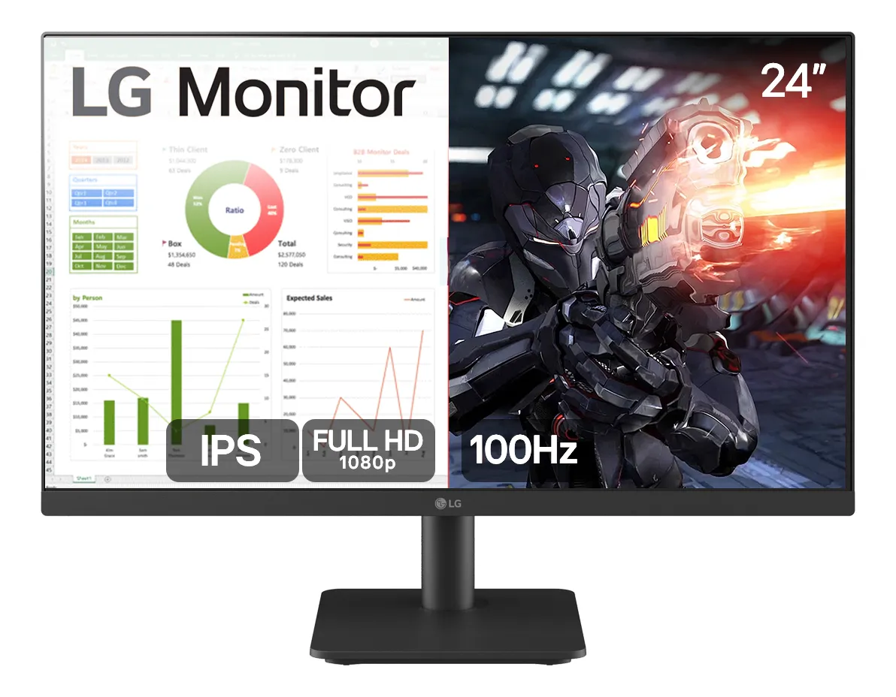

            

              <h4>Monitor Gamer LG 24” Full HD 100Hz</h4>
              
Monitor gamer LG 24” Full HD IPS com 100Hz, HDMI e recursos para jogos, oferecendo imagens mais fluidas.

              

                <strong>R$ 520,00</strong>
                 <!-- Botão para adicionar produto ao carrinho -->
                <button class="btn-carrinho">🛒</button>
              

            

          

          <!-- Animes -->
          

            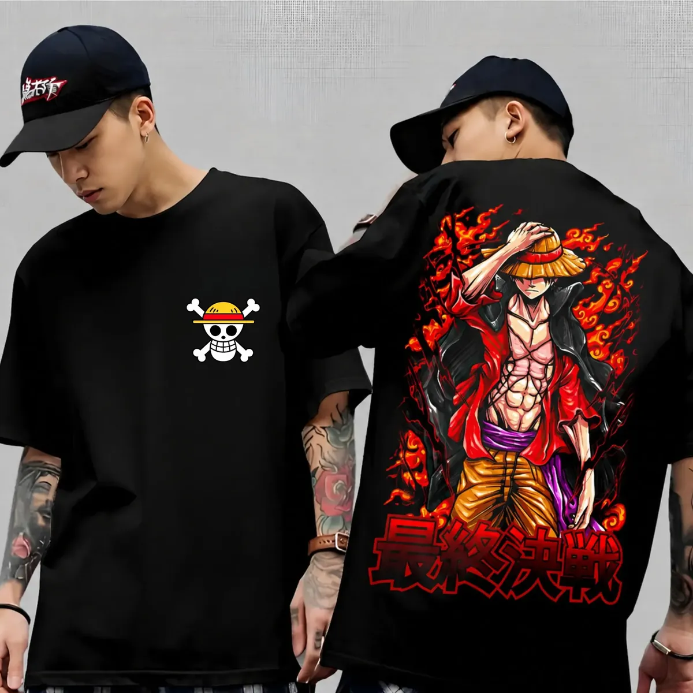

            

              <h4>Camiseta Luffy One Piece Gear 5</h4>
              
Camiseta One Piece com estampa do Luffy Gear 5, tecido confortável e estilo perfeito para fãs de anime.

              

                <strong>R$ 30,00</strong>
                 <!-- Botão para adicionar produto ao carrinho -->
                <button class="btn-carrinho">🛒</button>
              

            

          

          

            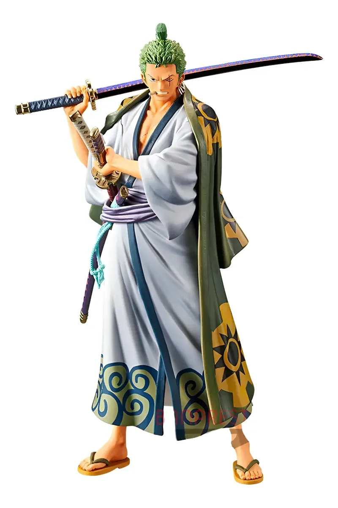

            

              <h4>Action Figure Roronoa Zoro</h4>
              
Boneco do Roronoa Zoro com base de apoio e espadas, ideal para decorar o setup ou completar a coleção.

              

                <strong>R$ 80,00</strong>
                 <!-- Botão para adicionar produto ao carrinho -->
                <button class="btn-carrinho">🛒</button>
              

            

          

          

            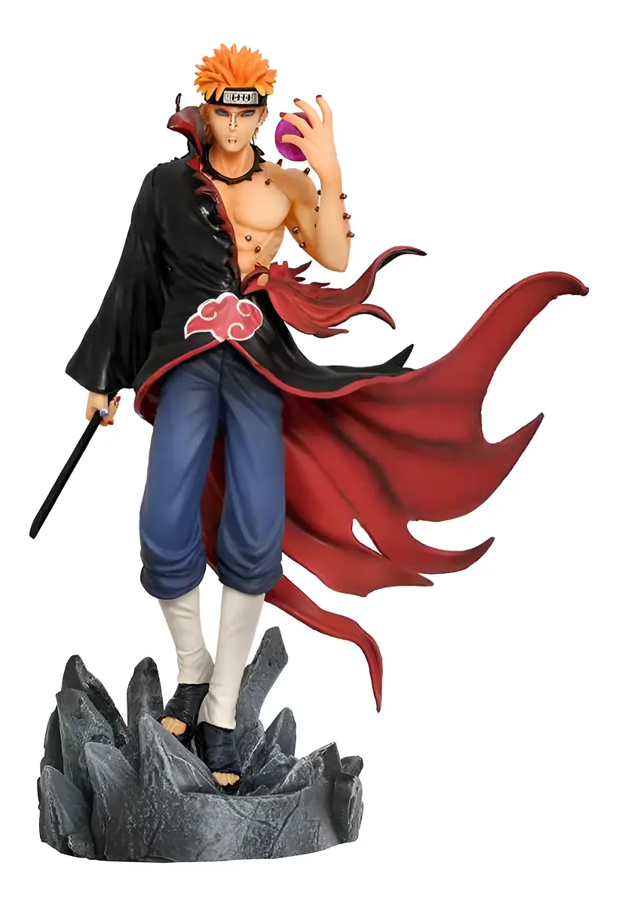

            

              <h4>Boneco Pain Naruto Shippuden 23cm</h4>
              
Estátua colecionável do Pain com 23cm, acabamento detalhado e base para exposição.

              

                <strong>R$ 94,50</strong>
                 <!-- Botão para adicionar produto ao carrinho -->
                <button class="btn-carrinho">🛒</button>
              

            

          

          

            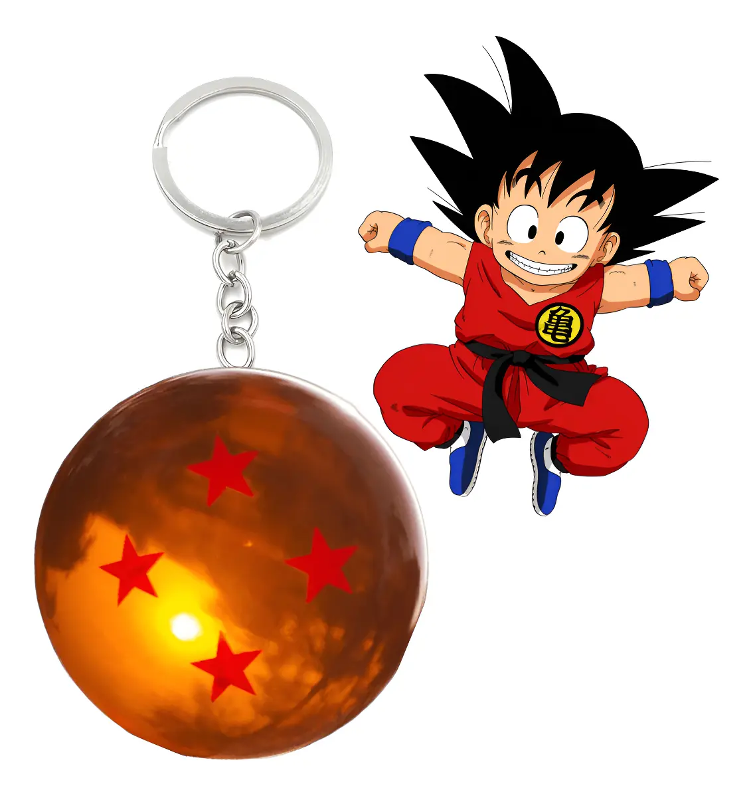

            

              <h4>Chaveiro Esfera do Dragão 4 Estrelas</h4>
              
Chaveiro da Esfera do Dragão de 4 estrelas, perfeito para chaves, mochilas ou coleção geek.

              

                <strong>R$ 19,90</strong>
                 <!-- Botão para adicionar produto ao carrinho -->
                <button class="btn-carrinho">🛒</button>
              

            

          

          <!-- Jogos -->
          

            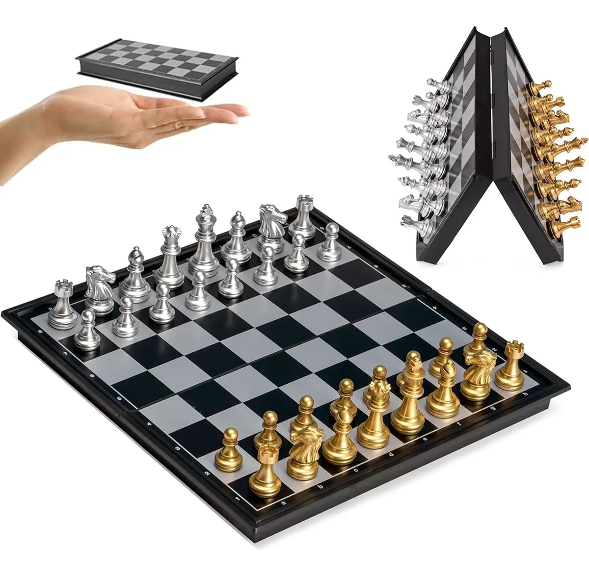

            

              <h4>Jogo de Xadrez Magnético Dobrável</h4>
              
Jogo de xadrez magnético dobrável, compacto e prático para jogar em casa ou levar em viagens.

              

                <strong>R$ 46,90</strong>
                 <!-- Botão para adicionar produto ao carrinho -->
                <button class="btn-carrinho">🛒</button>
              

            

          

          

            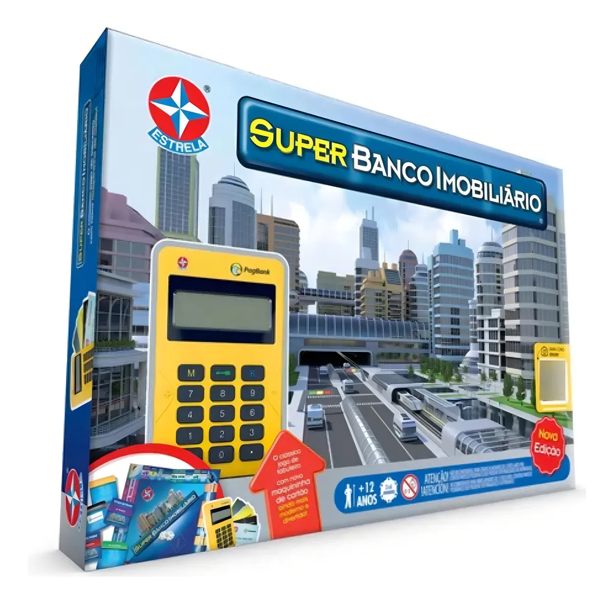

            

              <h4>Super Banco Imobiliário com Maquininha</h4>
              
Jogo Super Banco Imobiliário com tabuleiro, maquininha, cartas, dados e peças para partidas divertidas em grupo.

              

                <strong>R$ 169,99</strong>
                 <!-- Botão para adicionar produto ao carrinho -->
                <button class="btn-carrinho">🛒</button>
              

            

          

          

            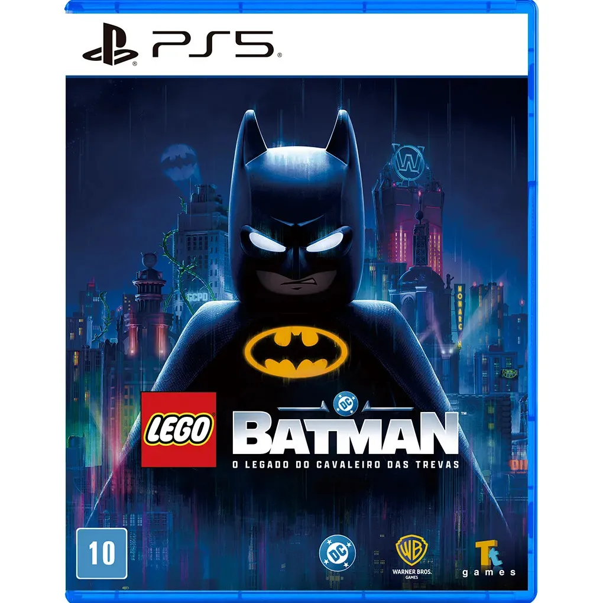

            

              <h4>Jogo LEGO Batman PS5</h4>
              
Jogo LEGO Batman para PS5 com ação, aventura, mundo aberto e modo offline para até 2 jogadores.

              

                <strong>R$ 299,99</strong>
                 <!-- Botão para adicionar produto ao carrinho -->
                <button class="btn-carrinho">🛒</button>
              

            

          

          

            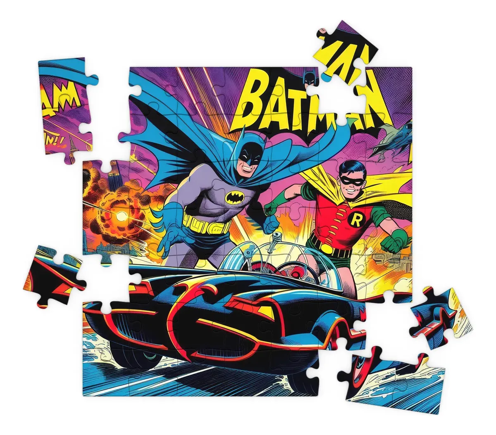

            

              <h4>Quebra-cabeça Batman e Robin MDF</h4>
              
Quebra-cabeça premium em MDF com 49 peças, impressão de alta qualidade e visual inspirado em Batman e Robin.

              

                <strong>R$ 49,99</strong>
                 <!-- Botão para adicionar produto ao carrinho -->
                <button class="btn-carrinho">🛒</button>
              

            

          

          

            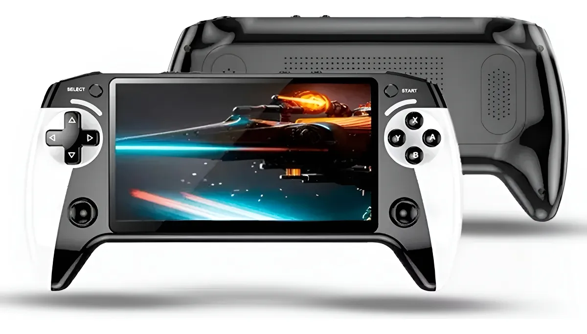

            

              <h4>Console X9 Premium Portátil</h4>
              
Console portátil compacto com 16GB, ideal para jogar em qualquer lugar com praticidade e diversão.

              

                <strong>R$ 246,00</strong>
                 <!-- Botão para adicionar produto ao carrinho -->
                <button class="btn-carrinho">🛒</button>
              

            

          

          <!-- Séries -->
          

            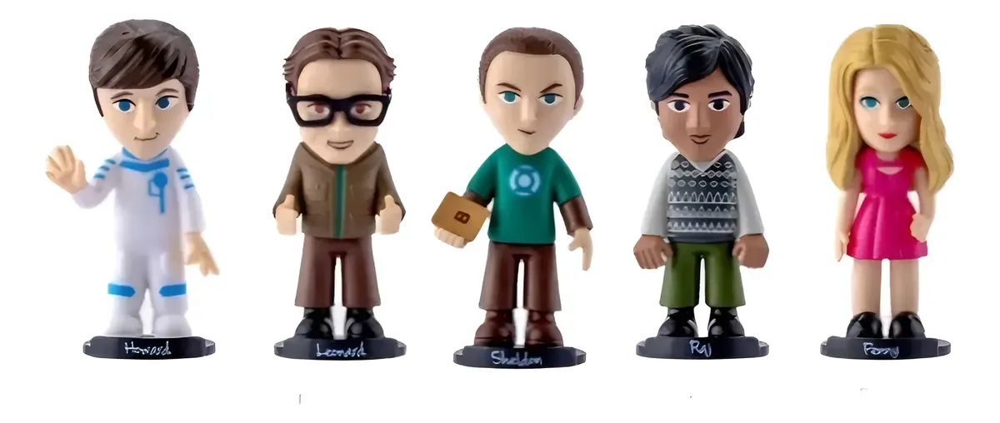

            

              <h4>Bonecos The Big Bang Theory</h4>
              
Bonecos colecionáveis inspirados em The Big Bang Theory, ideais para fãs da série e decoração geek.

              

                <strong>R$ 450,99</strong>
                 <!-- Botão para adicionar produto ao carrinho -->
                <button class="btn-carrinho">🛒</button>
              

            

          

          

            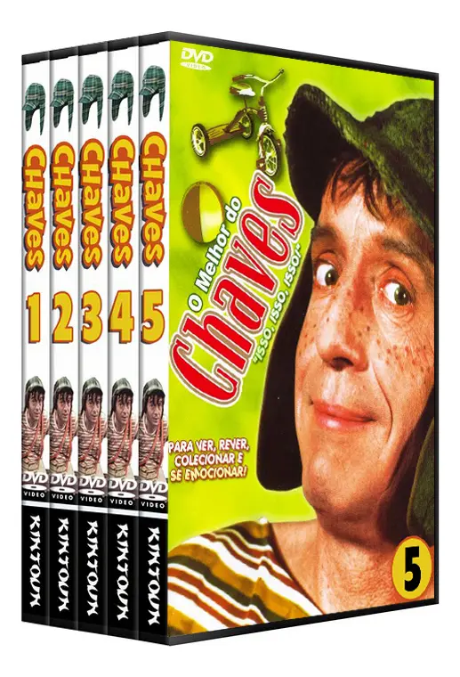

            

              <h4>DVDs Chaves Série Completa</h4>
              
Coleção completa de Chaves em DVD com 275 episódios clássicos para assistir e reviver momentos nostálgicos.

              

                <strong>R$ 171,00</strong>
                 <!-- Botão para adicionar produto ao carrinho -->
                <button class="btn-carrinho">🛒</button>
              

            

          

          

            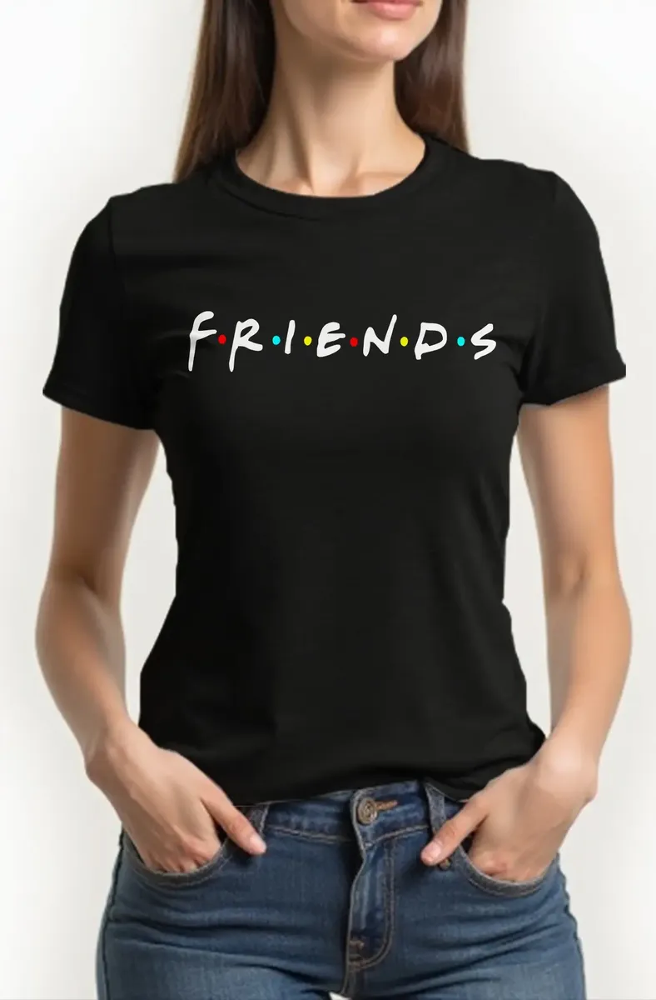

            

              <h4>Baby Look Friends Feminina</h4>
              
Baby look feminina Friends em algodão, com modelagem confortável e estampa perfeita para fãs da série.

              

                <strong>R$ 37,00</strong>
                 <!-- Botão para adicionar produto ao carrinho -->
                <button class="btn-carrinho">🛒</button>
              

            

          

          

            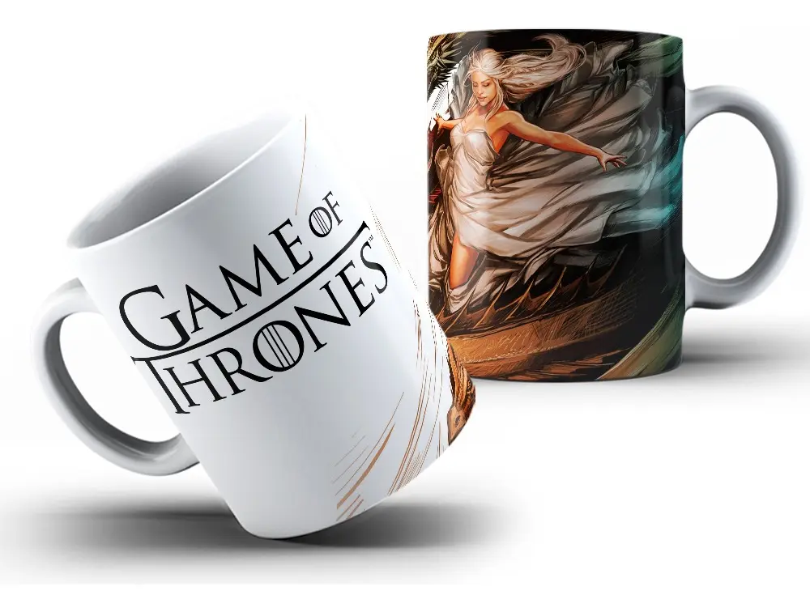

            

              <h4>Caneca Game of Thrones 325ml</h4>
              
Caneca de porcelana Game of Thrones com 325ml, estampa personalizada e acabamento resistente.

              

                <strong>R$ 52,00</strong>
                 <!-- Botão para adicionar produto ao carrinho -->
                <button class="btn-carrinho">🛒</button>
              

            

          

          

            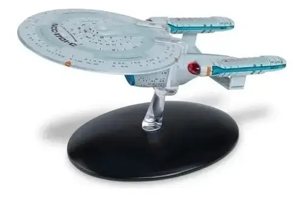

            

              <h4>Miniatura Nave Star Trek Enterprise</h4>
              
Miniatura da nave Enterprise em die-cast, com acabamento detalhado e embalagem colecionável.

              

                <strong>R$ 158,00</strong>
                 <!-- Botão para adicionar produto ao carrinho -->
                <button class="btn-carrinho">🛒</button>
              

            

          

        

      

    </section>

      <!-- Rodapé da página -->
<footer class="rodape">
  
© 2025 Geek Legends - Todos os direitos reservados.

</footer>

  </main>

  <!-- JavaScript da página de produtos -->

</body>

</html>
</file>

<file path="README.md">
DOCUMETAÇÃO
[Geek Legends GIT.pdf](https://github.com/user-attachments/files/26072522/Geek.Legends.GIT.pdf)
</file>

<file path="sobre.html">
<!DOCTYPE html>
<html lang="pt-BR">

<head>
  <meta charset="UTF-8">
  <meta name="viewport" content="width=device-width, initial-scale=1.0">
  <title>Sobre - Geek Legends</title>

  <!-- CSS da página sobre -->
  <link rel="stylesheet" href="assets/css/sobre.css">
</head>

<body>

  <!-- Cabeçalho com logo e menu -->
  <header class="cabecalho">
    

      
GL

      

        <h1>Geek Legends</h1>
        
Produtos Dignos de Lenda

      

    

    <nav>
      <a href="index.html">Início</a>
      <a href="produtos.html">Produtos</a>
      <a href="sobre.html" class="ativo">Sobre</a>
      <a href="login.html">Login</a>
      <a href="carrinho.html" class="link-carrinho"> 🛒 0 </a>
    </nav>
  </header>

  <main class="conteudo">

    <!-- Título principal da página -->
    <section class="topo-sobre">
      <h2>Sobre a Geek Legends</h2>
      
Sua loja especializada em produtos geek, tecnologia e cultura nerd desde 2020

    </section>

    <!-- Card da missão -->
    <section class="missao">
      <h3>Nossa Missão</h3>

      

        Conectar fãs de cultura geek com os melhores produtos do universo nerd.
        Desde action figures colecionáveis até tecnologia de ponta para gamers,
        nossa missão é trazer produtos dignos de lenda para verdadeiros entusiastas
        da cultura pop, games, animes, filmes e séries.
      

    </section>

    <!-- Cards de valores da loja -->
    <section class="valores">

      

        
⚡

        <h4>Inovação</h4>
        
Produtos de última geração e as novidades mais quentes do mercado geek.

      

      

        
🛡️

        <h4>Qualidade</h4>
        
Garantia em todos os produtos e suporte completo pós-venda.

      

      

        
🚚

        <h4>Entrega Rápida</h4>
        
Frete grátis e entrega rápida para todo o Brasil.

      

      

        
♡

        <h4>Paixão</h4>
        
Feito por geeks, para geeks. Entendemos o que você procura.

      

    </section>

    <!-- Rodapé da página -->
<footer class="rodape">
  
© 2025 Geek Legends - Todos os direitos reservados.

</footer>

  </main>

</body>

</html>
</file>

</files>
